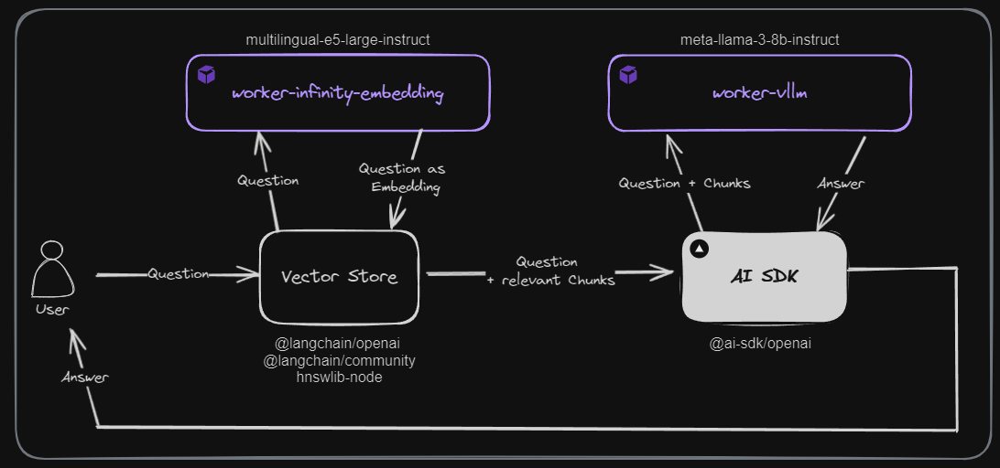
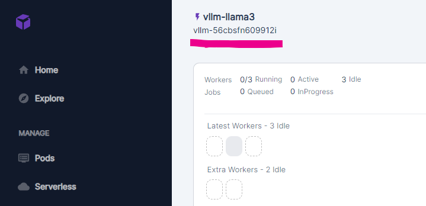
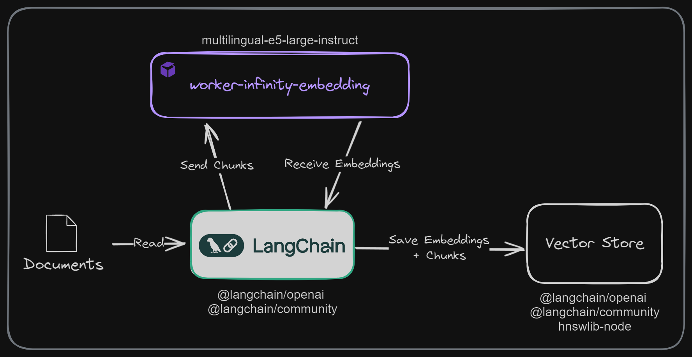

<h1 align="center">Ask Poddy</h1>

**Ask Poddy** is a user-friendly Retrieval-Augmented Generation (RAG) web application designed to
showcase the ease of setting up OpenAI-compatible APIs using open-source models hosted on RunPod.
Built with Next.js, React, Tailwind, Vercel AI SDK, and LangChain, it uses
[Meta-Llama-3-8B-Instruct](https://huggingface.co/meta-llama/Meta-Llama-3-8B-Instruct) for the LLM
and [multilingual-e5-large-instruct](https://huggingface.co/intfloat/multilingual-e5-large-instruct)
for text embeddings.

This tutorial will guide you through deploying **Ask Poddy** in your environment, enabling it to
answer questions related to RunPod effectively, by leveraging the open-source workers
[worker-vllm](https://github.com/runpod-workers/worker-vllm) and the
[worker-infinity-embedding](https://github.com/runpod-workers/worker-infinity-embedding) from
RunPod.


---

<!-- toc -->

-   [Concept](#concept)
-   [Prerequisites](#prerequisites)
-   [Tutorial: Setting Up "Ask Poddy" in Your Environment](#tutorial-setting-up-ask-poddy-in-your-environment)
    -   [1. Clone the Repository](#1-clone-the-repository)
    -   [2. Install Dependencies](#2-install-dependencies)
    -   [3. Set Up RunPod Serverless Endpoints](#3-set-up-runpod-serverless-endpoints)
        -   [3.1 Network Volumes](#31-network-volumes)
        -   [3.2 Worker-vLLM Endpoint](#32-worker-vllm-endpoint)
        -   [3.3 Worker-Infinity-Embedding Endpoint](#33-worker-infinity-embedding-endpoint)
    -   [4. Configure Environment Variables](#4-configure-environment-variables)
    -   [5. Populate the Vector Store](#5-populate-the-vector-store)
    -   [6. Start the Local Web Server](#6-start-the-local-web-server)
    -   [7. Use the RAG app](#7-use-the-rag-app)

<!-- tocstop -->

---

## Concept

**Ask Poddy** is designed to demonstrate the integration of OpenAI-compatible APIs with open-source
models, utilizing serverless endpoints to reduce costs. The application runs locally (but it could
also be deployed into the cloud), while the computational heavy lifting is handled by serverless
endpoints on RunPod. This architecture allows seamless use of existing OpenAI-compatible tools and
frameworks without needing to develop custom APIs, ensuring efficient and cost-effective
performance.

Here's how the RAG process works in **Ask Poddy**:



1. **User**: Asks a question.
2. **Vector Store**: The question is sent to LangChain, which uses the
   [worker-infinity-embedding](https://github.com/runpod-workers/worker-infinity-embedding) endpoint
   to convert the question into an embedding.
3. **Vector Store**: Performs a similarity search to find relevant documents based on the question's
   embedding.
4. **AI SDK**: The retrieved documents and the user's question are sent to the
   [worker-vllm](https://github.com/runpod-workers/worker-vllm) endpoint to generate an answer.
5. **worker-vllm**: Generates an answer using the
   [Meta-Llama-3-8B-Instruct](https://huggingface.co/meta-llama/Meta-Llama-3-8B-Instruct) model.
6. **User**: Receives the answer.

This process ensures that **Ask Poddy** can effectively answer questions by leveraging relevant
documents when interacting with the LLM.

<!-- prettier-ignore-start -->
> [!TIP] 
> We have choosen these two models as they are the best to date to generate texts in English. Feel free to use other models as well that fit in with your use case.
<!-- prettier-ignore-end -->

---

## Prerequisites

-   [Node.js and npm](https://nodejs.org/en) installed
-   [RunPod](https://www.runpod.io/) account

---

## Tutorial: Setting Up "Ask Poddy" in Your Environment

### 1. Clone the Repository

1. Clone the **Ask Poddy** repository and go into the cloned directory:

```bash
git clone https://github.com/blib-la/ask-poddy.git
cd ask-poddy
```

2. Clone the [RunPod docs](https://github.com/runpod/docs) repository into
   `ask-poddy/data/runpod-docs`.

```bash
git clone https://github.com/runpod/docs.git ./data/runpod-docs
```

<!-- prettier-ignore-start -->
> [!NOTE] 
> The [RunPod docs](https://github.com/runpod/docs) repository contains the RunPod documentation that **Ask Poddy** will use to answer
> questions.
<!-- prettier-ignore-end -->

3. Copy the `img` folder from `./data/runpod-docs/static/img` to `./public`

<!-- prettier-ignore-start -->
> [!NOTE] 
> This makes it possible for Ask Poddy to include images from the RunPod documentation when
> the LLM references them
<!-- prettier-ignore-end -->

### 2. Install Dependencies

Navigate to the `ask-poddy` directory and install the dependencies:

```bash
npm install
```

<br />

### 3. Set Up RunPod Serverless Endpoints

#### 3.1 Network Volumes

Using network volumes ensures that the models and embeddings are stored persistently, allowing for
faster subsequent requests as the data does not need to be downloaded or recreated each time.

1. Create two network volumes with 15GB storage each in the same data center as the serverless
   endpoints.
    - Volume for embeddings: `infinity_embeddings`
    - Volume for LLM: `vllm_llama3`

#### 3.2 Worker-vLLM Endpoint

1. Follow the guide for setting up the vLLM endpoint with
   [worker-vllm](https://github.com/runpod-workers/worker-vllm):
   [vLLM Setup Guide](https://docs.runpod.io/serverless/workers/vllm/get-started), but make sure to
   use the `meta-llama/Meta-Llama-3-8B-Instruct` model instead of the one mentioned in the guide.
   And also make sure to select the network volume `vllm_llama3` when creating the endpoint.

#### 3.3 Worker-Infinity-Embedding Endpoint

1. Create a template using this guide:
   [Create Template](https://docs.runpod.io/pods/templates/manage-templates#creating-a-template)
2. Use the Docker image `runpod/worker-infinity-embedding:stable-cuda12.1.0` from
   [worker-infinity-embedding](https://github.com/runpod-workers/worker-infinity-embedding) and set
   the environment variable `MODEL_NAMES` to `intfloat/multilingual-e5-large-instruct`.
3. Deploy a serverless endpoint using this guide:
   [Deploy Endpoint](https://docs.runpod.io/serverless/workers/get-started#deploy-a-serverless-endpoint).
   And also make sure to select the network volume `infinity_embeddings` when creating the endpoint.

### 4. Configure Environment Variables

1. Generate your RunPod API key using this guide:
   [Generate API Key](https://docs.runpod.io/get-started/api-keys)
2. Find the endpoint IDs underneath the deployed serverless endpoints.



3. Create your `.env.local` file with the following variables:

```bash
RUNPOD_API_KEY=your_runpod_api_key
RUNPOD_ENDPOINT_ID=your_vllm_endpoint_id
RUNPOD_ENDPOINT_ID_EMBEDDING=your_embedding_endpoint_id
```

### 5. Populate the Vector Store

To populate the vector store, run the following command:

```bash
npm run populate
```

<!-- prettier-ignore-start -->
> [!NOTE] 
> The first run will take some time as the worker downloads the embeddings model
> ([multilingual-e5-large-instruct](https://huggingface.co/intfloat/multilingual-e5-large-instruct)).
> Subsequent requests will use the downloaded model stored in the network volume.
<!-- prettier-ignore-end -->

This command reads all markdown documents from a defined folder, creates embeddings using the
embedding endpoint running on RunPod, and stores these embeddings in the local vector store:



1. **Documents**: The markdown documents from the `ask-poddy/data/runpod-docs/` folder are read by
   LangChain.
2. **Chunks**: LangChain converts the documents into smaller chunks, which are then sent to the
   `worker-infinity-embedding` endpoint.
3. **worker-infinity-embedding**: Receives chunks, generates embeddings using the
   `multilingual-e5-large-instruct` model, and sends them back.
4. **Vector Store**: LangChain saves these embeddings in the local vector store (`HNSWlib`).

<!-- prettier-ignore-start -->
> [!TIP] 
> A vector store is a database that stores embeddings (vector representations of text) to
> enable efficient similarity search. This is crucial for the RAG process as it allows the system to
> quickly retrieve relevant documents based on the user's question.
<!-- prettier-ignore-end -->

### 6. Start the Local Web Server

1. Start the local web server:

```bash
npm run dev
```

2. Open `http://localhost:3000` to access the UI.

### 7. Use the RAG app

Now that everything is running, you can ask your RunPod-related question, like:

-   How do I create a serverless endpoint?
-   What are the benefits of using a network volume?

<!-- prettier-ignore-start -->
> [!NOTE]
> The first run will take some time as the worker downloads the LLM
> ([Meta-Llama-3-8B-Instruct](https://huggingface.co/meta-llama/Meta-Llama-3-8B-Instruct)).
> Subsequent requests will use the downloaded model stored in the network volume.
<!-- prettier-ignore-end -->
